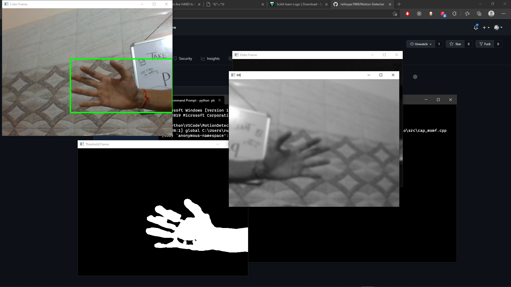
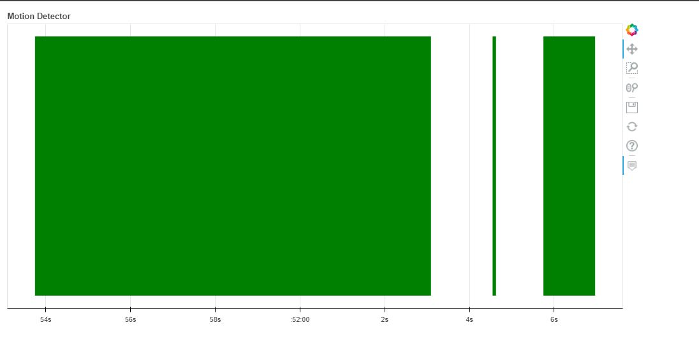

# Motion-Detector

### Woah Pretty good Motion Detector

It takes first frame to compare with next frames to detect that new object that entered tha screen.
After capturing all frames we need to press
## Press 'm' to end capturing frames
 to stop capturing and make a TimeSeries Graph with Bokeh (A Python Data Visualization Library)
 
To work with Frames i used OpenCV Python library.

Check some ssess....

